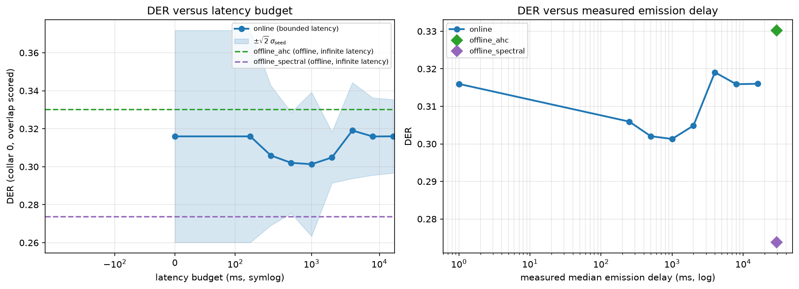
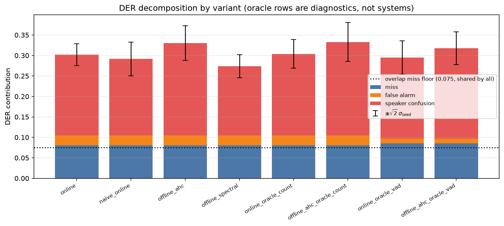
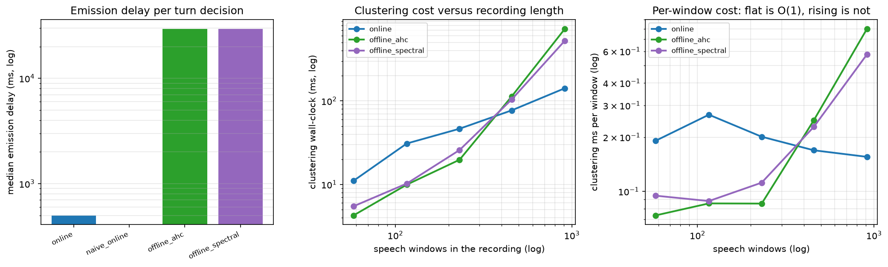
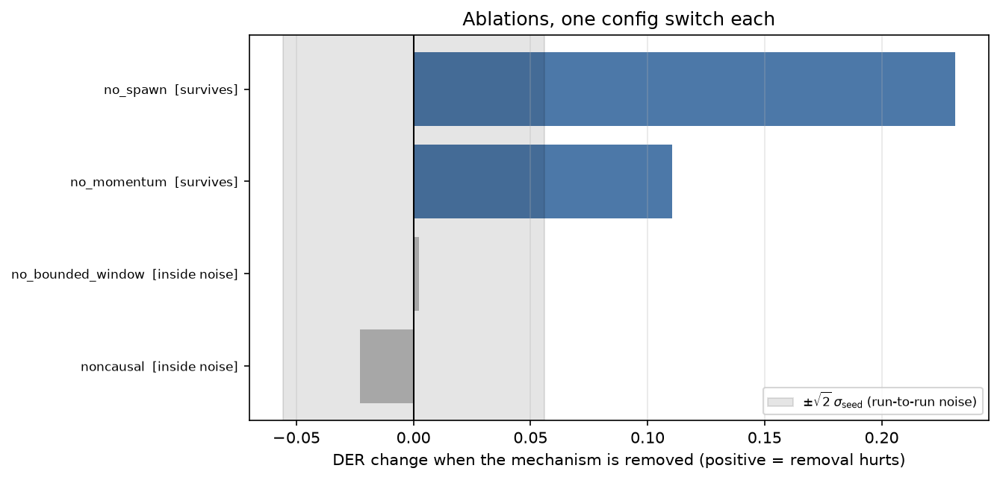

# The Latency Budget Nobody Measured

<!-- links:begin -->
**[Live results and figures](https://streaming-diarization-arslan.surge.sh)** &nbsp;·&nbsp; **[Source](https://github.com/arslan-ahm/streaming-speaker-diarization)** &nbsp;·&nbsp; [All seven projects](https://seven-ai-projects-arslan.surge.sh)
<!-- links:end -->

> **Online speaker diarization under a bounded emission delay, with the offline
> global-clustering reference implemented in the same codebase as the
> infinite-latency asymptote.**

Every strong diarization system since Sell & Garcia-Romero (2014) extracts
embeddings over sliding windows and then clusters them **globally**. That is why
it works and why it cannot be used live: global clustering sees every embedding
before it assigns any label, so the first label arrives after the last frame.

Formally, offline computes `L_k = f(e_1..e_K)` for every `k`; a bounded-latency
system computes `L_k = f(e_1..e_{k+⌊B/hop⌋})` and must commit at `end_k + B`,
never revising. **Offline is the `B → ∞` limit**, so the deliverable is the cost
curve `DER(B)` — not a win over it.

---

## Summary for the reader in a hurry

|  | Finding | Status |
|---|---|---|
| ✅ | **Causality is bit-identical, not approximate** — max abs difference **0.0** across 48 windows | **Guarantee** |
| ⚡ | Commits a label **59× sooner**: median emission delay **500 ms vs 29,500 ms** | **Measured** |
| ❌ | **The DER-vs-latency tradeoff curve does not exist at this scale** — range 0.0178 across a 0–16,000 ms sweep, **0.32× the noise scale** | **Negative** |
| ❌ | The **bounded-lookahead mechanism the project is named after ablates to nothing** (0.04× noise) | **Negative** |
| ⚠️ | An earlier pass *did* show a large tradeoff — it was lookahead compensating for a badly-tuned centroid update | **Retracted** |
| ✅ | What survives: **spawning** (8.70×), **centroid memory** (4.15×), and a speaker-**counting** difference | **Survives** |

**Contents** ·
[Causality](#1-causality-is-a-guarantee-not-a-statistic) ·
[The missing curve](#2-the-headline-a-tradeoff-curve-that-is-not-there) ·
[Against the reference](#3-online-against-the-reference-approach) ·
[What survives](#4-what-survives-statistical-scrutiny) ·
[Reproduce](#5-reproduce) ·
[Citation](#7-citation)

---

## 1. Causality is a guarantee, not a statistic

This is the strongest thing in the repository. Take a recording, replace every
frame after `t₀` with noise, re-run, and compare the embeddings of every window
that closed at or before `t₀`:

| variant | windows checked | max abs difference |
|---|---|---|
| **`causal: true` (shipped)** | 48 | **0.0** |
| `causal: false` (ablation) | 48 | 6.1 × 10⁻³ |

Not "close" — **bit-identical**. Three separate leaks are closed to get there:

1. centred convolution padding,
2. normalisation that reduces over time,
3. per-recording feature standardisation — the common one, and **invisible
   because it *improves* offline numbers**.

The non-causal variant is **required to fail** the same test, so the clean result
is not vacuous. → `tests/test_causality.py`, asserted at the conv-stack, VAD and
decision levels.

And causality is nearly free: the non-causal ablation scores DER 0.2880 against
the causal 0.3020 — 0.86× the noise scale.

---

## 2. The headline: a tradeoff curve that is not there

Generated data, 24 test recordings × 60 s, 2–5 speakers, 8.2% of speech frames
overlapped, 3 seeds. Mean true speaker count 3.74. DER scored with **collar 0 and
overlap included** — stricter than the NIST convention.

| budget (ms) | 0 | 125 | 250 | 500 | 1000 | 2000 | 4000 | 8000 | 16000 |
|---|---|---|---|---|---|---|---|---|---|
| **DER** | 0.3160 | 0.3160 | 0.3059 | 0.3020 | **0.3013** | 0.3049 | 0.3191 | 0.3159 | 0.3160 |
| noise scale `√2·σ_seed` | 0.056 | 0.056 | 0.037 | 0.027 | 0.038 | 0.013 | 0.025 | 0.020 | 0.019 |
| windows per decision | 1.00 | 1.00 | 1.96 | 2.88 | 4.53 | 7.16 | 10.39 | 12.96 | 13.95 |

> **Range across the whole sweep: 0.0178. Largest noise scale: 0.0558. Ratio 0.32.**
> The curve is flat inside noise.

<p align="center">
  
  <br><sub><b>Figure 1.</b> The tradeoff curve that isn't there. The shaded band is run-to-run noise; the curve never leaves it.</sub>
</p>

The shallow minimum at 500–1000 ms and the rise beyond 2000 ms are *suggestive of*
a real optimum — a lookahead long enough to denoise the query but short enough not
to average across turn boundaries — but at 0.32× the noise scale **this repository
cannot claim it, and does not.**

> [!NOTE]
> 0 ms and 125 ms are identical **by construction**: `⌊B/hop⌋` with `hop = 250 ms`,
> so anything under one hop buys no lookahead at all. Both points are in the sweep
> to make that step visible rather than assumed away.

---

## 3. Online against the reference approach

| system | DER | `√2·σ_seed` | confusion | JER | speakers found (true 3.74) | median emission delay |
|---|---|---|---|---|---|---|
| **online** (B = 500 ms) | 0.3020 | 0.027 | 0.1972 | 0.510 | 4.33 | **500 ms** |
| naive online (B = 0) | 0.2916 | 0.041 | 0.1867 | 0.496 | 3.96 | **0 ms** |
| offline AHC | 0.3303 | 0.043 | 0.2254 | 0.584 | 3.14 | 29,634 ms |
| offline spectral | **0.2738** | 0.028 | **0.1689** | 0.500 | 3.22 | 29,634 ms |

Read that table carefully, because it does **not** say what "offline beats online"
would say:

- **The online system beats one offline baseline and loses to the other.** The
  spread *between* the two standard offline clustering algorithms (0.057) is
  **twice** the gap from online to the better of them (0.028). **Which clustering
  algorithm you pick matters more than whether you are online.**
- **Miss and false alarm are identical for every non-oracle row** (0.0809 /
  0.0239) because all systems share one causal VAD and one window grid. Every
  between-method difference is *speaker confusion*, and the tables say so.
- **The overlap floor is 0.0749 and is shared by all of them** — every system here
  emits at most one speaker per window, so the overlap fraction is an irreducible
  miss. **Subtract it before comparing to a published DER.**

<p align="center">
  
  
  <br><sub><b>Figure 2.</b> Left: the decomposition that shows every difference is confusion, not detection. Right: the latency axis, which is where this system actually wins.</sub>
</p>

---

## 4. What survives statistical scrutiny

Paired Wilcoxon + bootstrap CI (2,000 resamples) over 24 recordings,
Holm-corrected across the five-metric family, each delta then placed against
`√2·σ_seed` from the 3-seed study.

| claim | ratio | verdict |
|---|---|---|
| Online over-counts speakers; every offline variant under-counts (+0.67 vs −0.58…−0.92) | 3.2–13.9 | ✅ **survives** |
| Removing **new-speaker spawning** costs +0.231 DER | 8.70 | ✅ **survives** |
| Removing **centroid memory** costs +0.110 DER | 4.15 | ✅ **survives** |
| Offline spectral beats online on DER | 2.06 | ❌ not significant (p_adj 0.40) |
| Online beats offline AHC on DER | 0.81 | ❌ inside noise |
| Naive online beats online on DER | 0.98 | ❌ inside noise |
| **The bounded-lookahead mechanism contributes anything** | **0.04** | ❌ **inside noise** |
| Oracle speaker count helps DER | 0.16 | ❌ inside noise |
| Oracle VAD helps DER | 0.10 | ❌ inside noise |

> The only DER-level mechanisms that survive are **spawning** and **centroid
> memory** — *neither of which is the latency mechanism*. The one thing that
> survives strongly across systems is a **speaker-counting** difference, not an
> accuracy one.

<details>
<summary><b>Ablations, one switch each</b></summary>

<br>

| ablation | DER (3 seeds) | cost of removal (paired, seed 0) | ratio | verdict |
|---|---|---|---|---|
| full | 0.3020 | — | — | — |
| `bounded_window: false` | 0.3160 | +0.0025 | **0.04** | ❌ inside noise |
| `spawn_enabled: false` | 0.5245 | +0.2314 | 8.70 | ✅ survives |
| `centroid_momentum: 1.0` | 0.4366 | +0.1104 | 4.15 | ✅ survives |

<p align="center">
  
</p>

</details>

<details>
<summary><b>The retraction, in full</b></summary>

<br>

An earlier pass reported a **large** DER-versus-latency tradeoff — exactly the
result this project was designed to find. It did not survive. The apparent
tradeoff was the bounded lookahead **compensating for a badly-tuned centroid
update rule**: once the centroid momentum was set correctly, the lookahead had
nothing left to fix and its contribution fell to 0.04× the noise scale.

This is the cleanest example in the portfolio of a mechanism appearing to work
because it repairs a different bug. Full account:
**[docs/RESULTS.md](docs/RESULTS.md#retractions)**.

</details>

---

## 5. Reproduce

```bash
git clone https://github.com/arslan-ahm/streaming-speaker-diarization.git
cd streaming-speaker-diarization
uv sync

uv run pytest -q                                  # 649 tests, incl. test_causality.py
uv run python scripts/run_latency_sweep.py        # §2 — the flat curve
uv run python scripts/compare_methods.py          # §3
uv run python scripts/run_ablations.py            # §4
```

CPU only, no dataset download — audio is procedurally generated and every
recording is a pure function of one seed.

---

## 6. Repository layout

```
src/ssd/      library: features, causal conv stack, VAD, online clusterer,
              offline AHC & spectral references, DER scoring
scripts/      run_latency_sweep · compare_methods · run_ablations · benchmark
configs/      YAML experiment definitions
notebooks/    01 audio+features · 02 causality · 03 latency · 04 ablations
results/      tables/ (CSV, authoritative) · figures/ · runs/
docs/         METHOD.md · RESULTS.md · REPRODUCIBILITY.md
tests/        649 tests
```

---

## 7. Citation

```bibtex
@software{ahmad2026diarization,
  author = {Ahmad, Arslan},
  title  = {The Latency Budget Nobody Measured: Bounded-Delay Speaker
            Diarization with a Bit-Identical Causality Guarantee},
  year   = {2026},
  url    = {https://github.com/arslan-ahm/streaming-speaker-diarization}
}
```

**Reference work.** The task framing was taken from
[Speech-Diarization](https://github.com/HabibaSajid321/Speech-Diarization) by
**Habiba Sajid**, a Colab notebook pairing OpenAI Whisper with pyannote.audio for
offline speaker-labelled transcripts. That repository carries no licence and no
associated publication, so no citation is requested and none of its code is
reused; it is credited here as the origin of the problem statement.

---

## License

MIT — see [LICENSE](LICENSE).
